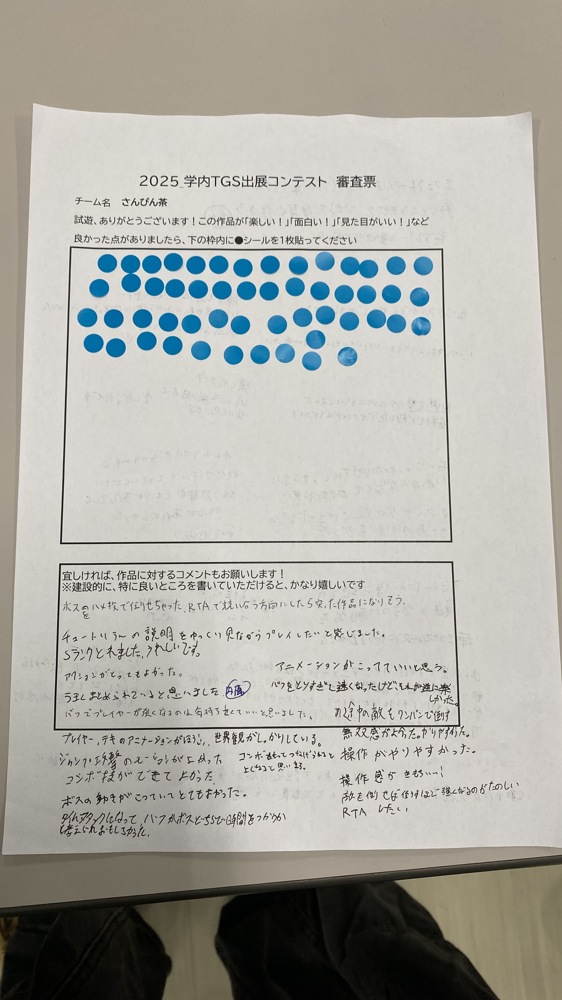
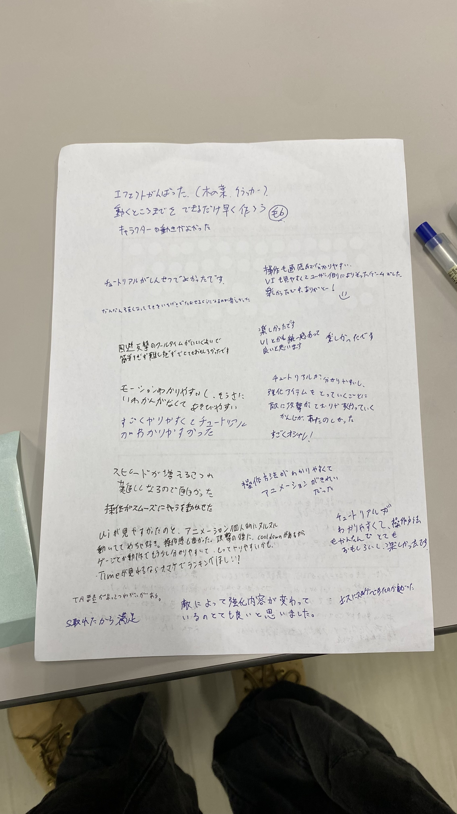

## 🎮 2025 チーム制作「学内TGS出展コンテスト」

### 作品概要

このゲームは、クラスメイトでチームを組んで開発を行う「チーム制作」で作ったものです。  
今回はいままでとは違い後輩とチームを組んで制作しました。  
内容は2Dの横スクロールアクションとなっており、ステージ上の敵を倒しながら進んでいき、最後のボスを討伐するまでのタイムアタックとなっています。  
敵は倒すと移動速度向上や攻撃力強化のバフをドロップしますが、倒すにはそれなりに時間がかかるので、その辺の駆け引きが重要となっています。  
また、実装において新たなフレームワークを使用しました。

ゲームジャンル: 2D 横スクロール アクション

開発環境/使用言語: Visual Studio 2022 | GitHub | C++ | DxLib | OpenSiv3D

制作期間: 約 3 ヶ月（25/04/08 - 25/07/15）

制作人数: 5 名

担当箇所: 敵のボス | ゲームシーケンス | ステージ処理 | オブジェクト管理 | アセット管理 | 物理シミュレーション | 衝突判定処理

紹介動画: [YouTube](https://youtu.be/0J1ENmlKk9A)

### 制作背景

TGS 2025 に出展する作品を学内で決めるコンテストで、入選される目標で制作しました。

### 挑戦したこと

・新たなフレームワークの使用をチームに提案し、プロジェクトやシステム面での保守  
・本制作とは別で、フレームワークの仕様調査や最適な設計の研究

### 学んだこと

今回の制作でも、普段のプログラミングの授業でお馴染みの DxLib というフレームワークを使っていました。  
ですが、ゲームの仕様上必要なオブジェクト管理や衝突判定などの実装で難航していたことがあり、より先進的でモダンな OpenSiv3D という同じく C++ のフレームワークを私自身が少し触ったこともあったので、チームに提案して移行しました。

今回のチーム制作では新しいフレームワークを使ったこともあり、使い方もわからない中試行錯誤したことで、主に技術面で多く学びがありました。  
各オブジェクト同士の衝突判定や、オブジェクト生成/管理などの実装を通して、設計の考え方を磨き上げあげることができました。

### こだわったところ

・新しいフレームワークを使用し、保守と設計を担当

今回の制作では、新たに「 OpenSiv3D 」というC++フレームワークを使用しました。  
このフレームワークの特徴として、最新のグラフィックスAPIを採用していることによる高速な描画パイプライン、モダンなAPI設計、豊富な機能と公式ドキュメント、質問や作品紹介ができるコミュニティの存在（実際に今回使用）、マルチプラットフォーム対応（Windows、macOS、Linux、Webなど）など、たくさんあります。  
また、テクスチャやフォントの管理が効率的でメモリの使用も抑えられており、DxLibと比べてメモリリークの危険性も少ないほか負荷の高い処理でも安定して動作します。

開発時では、ラムダ式や範囲forなどモダンC++の機能と親和性が高く、直感的でシンプルなコードでゲームやツールを作れる点が大きな強みです。  
DxLibの場合、描画や入力処理の多くが手続き型で記述されるため、クラス設計や関数オブジェクトとの組み合わせに工夫が必要ですが、Siv3Dでは関数型スタイルで自然に記述でき、コード量を減らしつつ可読性を高く保てます。

（普段使いのMacでもビルドできるので集中して取り組めました）

ですが、最初は仕様でわからないことも多く、試行錯誤の日々でしたが、本制作とは別で個人リポジトリで研究を行ってゲームベースを作り、なんとかゲームの実装に進めました。  
ゲームベースの開発では、Siv3Dに備わっている物理衝突の判定機能や物理シミュレーション機能を使い、オブジェクト管理やステージ処理などは自分で設計しました。  
オブジェクト管理やステージ処理では、ポインタやアドレス、シングルトンの知識が必要だったので、検定時の記憶をなんとか引き出して実装できました。

[【GitHubリポジトリ】Siv3Dの研究で作ったゲームベース（Webビルドをデプロイしてあるので実際に試遊できます）](https://github.com/kanaaa224/siv3d-2d-game-base)

（フレームワークの仕様調査、設計の研究で開発したゲームベースです。本制作で完成したソースコードをベースとして使用しました）

（ゲームベースの設計が未熟で例外スローを起こした時の画面です）

今回の制作を通してSiv3Dの便利さを実感しましたが、DxLibでの勉強は必要だったと考えており、限られた機能や制約の中で試行錯誤を繰り返した経験が、結果的に実装力の向上につながったと感じています。  
自分で衝突判定をしたり、アセット管理、動作の最適化やメモリ管理を行ってきた経験があったからこそ、Siv3Dの機能を理解した上で使いこなすことができ、便利さを正しく活かせたと思います。

・遊びごたえのあるボスの実装

今回の制作では初めての敵ボスの実装を担当しました。  
初めての敵キャラクターの実装ということもあり、攻撃方法や動きの面やセンスで未熟なところが多く、キャラの実装を経験してきたメンバーに質問漬けの日々でしたが、なんとか仕様よりも多くの攻撃を実装できました。  
また、いままでの制作では作りきれなかったことが多かった、画面の揺れや葉っぱが降ってくるなどの演出、土煙などのエフェクトを実装できました。

（今回制作した敵ボスです。倒すとクリアとなります）

### その他の写真

